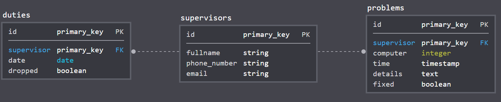

# Simple Duty Website

## Schema Diagram

## Installation
1. Install PostgreSQL from [here for Ubuntu](https://www.postgresql.org/download/linux/ubuntu/)
2. Install packages `postgresql-9.6 libpq-dev`
3. Change password of default password of PostgreSQL user `postgres` to `password`
  * `sudo -u postgres psql`
  * `\password`
  * Change the password to `password`
  * `\quit`
3. Run `bundle install`
4. `chmod +x ./bin/*`
5. `bin/rails db:create db:migrate`
6. Finally, `bin/rails s`